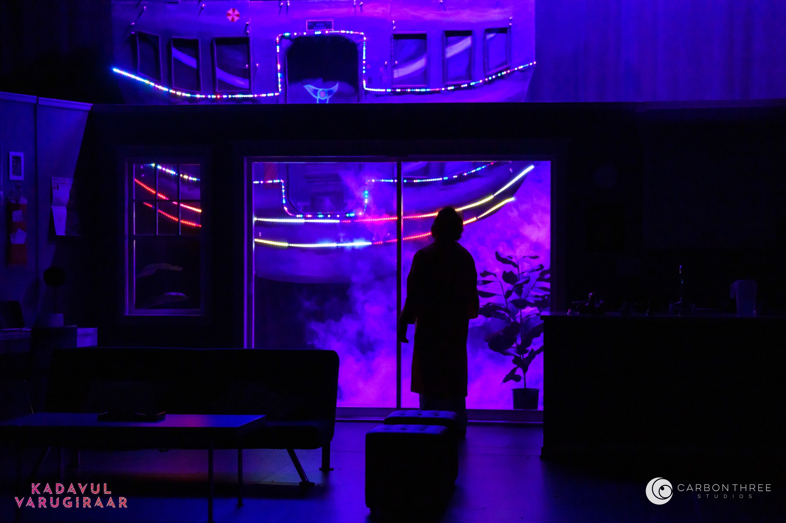

# SpacePot - A Space Odyssey

This repository contains code that controlled the LEDs on a Space Ship prop in the play "Kadavul Varugurar" by the Seattle based performance arts group [Indus Creations](https://www.induscreations.com/)

It had the following features
1. Support multiple LED strings
2. Configure individual strings to differnet lighting patterns
3. Control the LED scheme thought Web Page hosted on the circuit
4. Update the firmware through thr webpage.

After the show the project has had a life of it own with being a generic solution as a WiFi base multi-LED string controller. 
Hope it is useful as starter for your project.